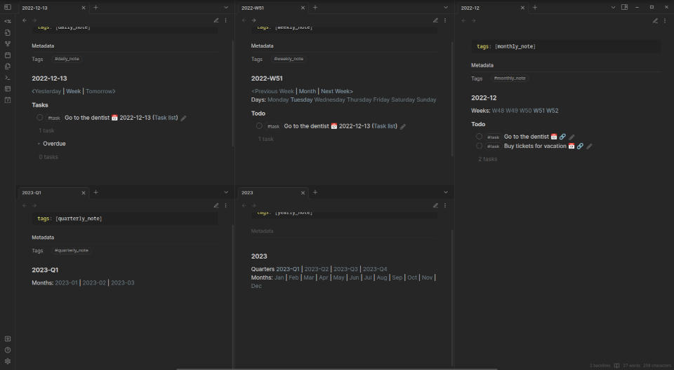

# Obsidian examples
This vault contains different examples of stuff I either made for myself or by answering questions from others. You can look through it folder by folder or just download and open it locally in your Obsidian.
Each folder contains a file that explains what is needed to recreate it, so that you can download just those files or just look at code/markdown and make it manually.
Everything was made with plugins that are inside .obsidian/plugins folder, so if anything is broken for you it might be a different plugin version.

## Overview
### Periodic notes templates
Set of periodic notes templates that use Templater to automatically link between each other and show appropriate tasks if you are using Tasks plugin.
Examples are in [Periodic_notes](Periodic_notes) folder and requirements in [Periodic_notes/Periodic notes - reqs](Periodic_notes/Periodic notes - reqs).

### Anime and Manga MyAnimeList API using Templater
The [Scripts/myanimelist.js](Scripts/myanimelist.js) is a Templater user script that uses [Jikan - Unofficial MyAnimeList API](https://jikan.moe/) to fetch data from MyAnimeList. That data can then be inserted in your notes by Templater. It uses the link found in your clipboard so you need to copy the link for Anime/Manga from MAL and then run the appropriate Templater code.
You can check [Anime_and_manga_templater](Anime_and_manga_templater) folder for examples.
Here's a quick demo

### Youtube notes as cards with thumbnails

### Media and authors - dataview

