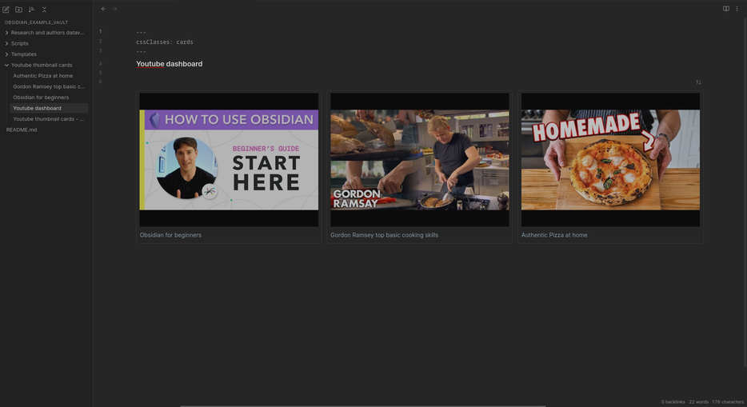
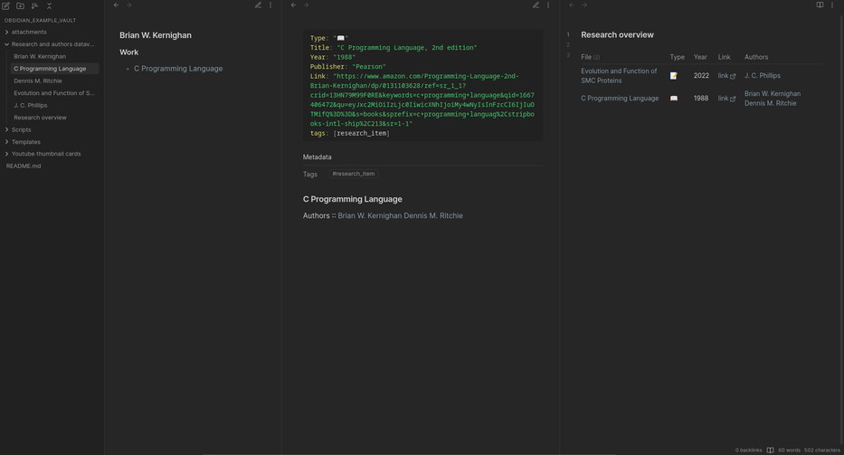

# Obsidian examples
This vault contains different examples of stuff I either made for myself or by answering questions from others. You can look through it folder by folder or just download and open it locally.
Each folder contains a file that explains what is needed to recreate it, so that you can download just those files or just look at code/markdown and make it manually.
Everything was made with plugins that are inside .obsidian/plugins folder, so if anything is broken for you it might be a different plugin version.

## Overview
### Youtube notes as cards with thumbnails

### Media and authors - dataview

### Periodic notes templates
Set of periodic notes templates that use Templater to automatically link between each other and show appropriate tasks if you are using Tasks plugin.

